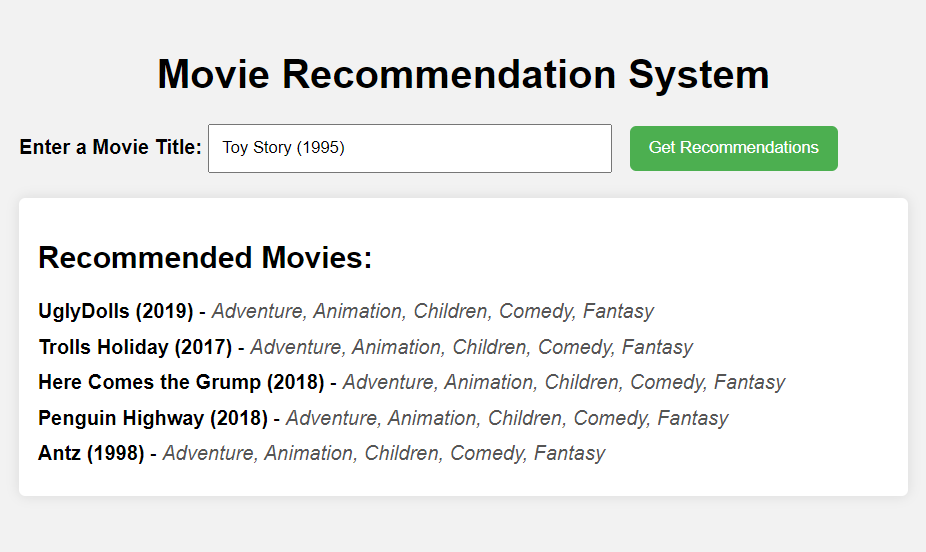

# Movie recommender
A machine learning model using collaborative filtering to recommend movies. This project explores three different types of recommendation systems based on user ratings and movie genres.

## Project Overview
This project ws done as a way to understand collaborative filtering. It aims building a movie recommendation system that suggest movies based on three different systems.

## Datasets
I used datasets from Kaggle :
- **Movies Dataset**: Contains information about movies, including titles and genres.

- **Ratings Dataset**: Includes user ratings for various movies.

You can find them in the link below:
https://www.kaggle.com/datasets/parasharmanas/movie-recommendation-system?resource=download

## Recommendation Systems

### 1. Movie-Based Collaborative Filtering
This model identifies similar movies based on user ratings. By analyzing the ratings given to a particular movie, it recommends other movies that have been rated similarly by users.

### 2. Genre-Based Collaborative Filtering
This model recommends movies based solely on their genres, without considering user ratings. 

### 3. Combined Genre and Ratings-Based Collaborative Filtering
This last one combines both user ratings and movie genres to provide better recommendations.

## App
At the end of the project, I integrated a user-friendly interface using FastAPI, allowing for easier interaction with the recommendation model. The application provides five movie recommendations at a time.

Since the first and last recommendation systems rely on user ratings—which necessitate a user ID—I chose to implement the second version that solely utilizes the genres of the movies for recommendations. This approach simplifies the process and eliminates the need for user-specific data.

It’s crucial to verify the movies dataset, as the app requires the exact title of the movie to function correctly.

# Future improvements
- Creating an app that list movies, and each user can like some movies, and integrate this model to give the user recommendations.

#### NB: If you have any suggestions, don't hesitate to contact me! 